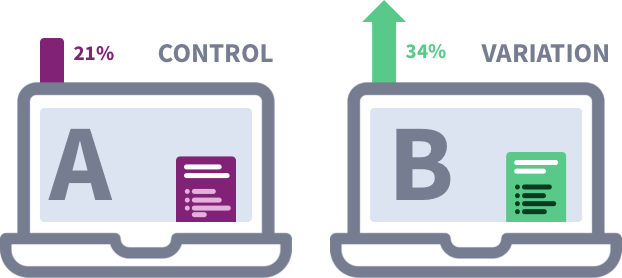

Introduction
============================

Controlled hypothesis testing has always been an important part of the the applied sciences and being able to determine whether or not an intervention has had a significant effect is always a question at the front of any experimenter's mind. The digital world is not exempt from this, and in recent years online experimentation has become an imperative part of digital product roadmaps. Developers, analysts and data scientists are able to leverage the power of digital experimentation platforms to test one - or multiple - versions of their digital products in order to determine statistical winners.

You may have heard this form of experimentation referred to as "A/B Testing", whereby traffic is both evenly and randomly distributed to audiences online, displaying two different variations of the same entity. Powerful statistical engines that use either (or both) frequentist and Bayesian methods calculate the difference (or lack therof) between experimental conditions to aid in product releases or changes to sites:

But what about if your experiment is paused and you have forgotten to test a certain metric, cluster or segment of your audience? Or, what about if you want to clean the data in a certain way and re-apply statistical tests? Or, what if having a contract with an A/B testing vendor is not commercially viable and you want to perform post-hoc analysis on raw analytics data from your site?

This series of Jupyter Notebooks I have compiled since working as an Experimentation Data Scientist may be able to assist you. This series of annotated tutorials provides walk-throughs in Python for a variety of dependent variables from click-through rates/probabilities to continuous/browser-level data. To be alligned with your A/B testing vendor (or your method of choice/habit) I have written frequentist and Bayesian approaches for the chapters in question, using some of Python's power statistical and sampling packages.
